<!--

author:   Central Research Data Management of Kiel University
email:    fdm@rz.uni-kiel.de
version:  0.1.0
language: en
narrator: UK English Female

icon:     assets/images/cau-norm-en-lilagrey-rgb.png

logo:     https://git-scm.com/images/branching-illustration@2x.png

comment:  Online course for getting started with the version control system Git
          and the open source software development platform GitLab.

script:   https://cdn.jsdelivr.net/npm/mermaid@9.1.1/dist/mermaid.min.js

@mermaid
<script run-once="true" modify="false">
mermaid.initialize({});

var svg = mermaid.render('io9wuwzxt',`@0`.replace(/\\n/g, "\n"),
function(g) {
    return true;
})

"HTML: " + svg
</script>
@end

script:   https://s.plantuml.com/synchro2.min.js

@plantUML : @plantUML.exec(svg,```@0```)

@plantUML.svg: @plantUML.exec(svg,```@0```)

@plantUML.png: @plantUML.exec(png,```@0```)

@plantUML.exec
<script run-once modify="false">
function draw(type, code, counter = 10) {
  try {
    let s = unescape(encodeURIComponent(code));
    var arr = [];
    for (let i = 0; i < s.length; i++) {
      arr.push(s.charCodeAt(i));
    }
    let compressor = new Zopfli.RawDeflate(arr);
    let compressed = compressor.compress();
    let dest = "https://www.plantuml.com/plantuml/" + type + "/" + encode64_(compressed);
    send.html("")
    send.stop()
  } catch(e) {
    if (counter > 0) {
      setTimeout(draw(type, code, counter - 1), 100)
    } else {
      send.stop()
    }
  }
}

draw("@0", `@1`)
</script>

<span>

</span>
@end

@plantUML.eval
<script>
function draw(type, code, counter = 10) {
  try {
    let s = unescape(encodeURIComponent(code));
    var arr = [];
    for (let i = 0; i < s.length; i++) {
      arr.push(s.charCodeAt(i));
    }
    let compressor = new Zopfli.RawDeflate(arr);
    let compressed = compressor.compress();
    let dest = "https://www.plantuml.com/plantuml/" + type + "/" + encode64_(compressed);
    console.html("")
    console.log(dest)
    send.lia("LIA: stop")
  } catch(e) {
    if (counter > 0) {
      setTimeout(draw(type, code, counter - 1), 50)
    } else {
      send.lia("LIA: stop")
    }
  }
}

draw("@0", `@input`)
""
</script>
@end

-->

# Getting started with Git and GitLab

**Thorge Petersen, Britta Petersen, Thilo Paul-Stüve**

Central Research Data Management of Kiel University

> To see this document as an interactive LiaScript rendered version, click on the
> following link/badge:
>
> [](https://liascript.github.io/course/?https://cau-git.rz.uni-kiel.de/fdm/schulungen/git-einfuehrung/-/raw/main/course.md)
>
> This course assumes a basic knowledge of command line interfaces.
>
> If you need help, feel free to ask us any questions:
>
> [fdm@rz.uni-kiel.de](mailto:fdm@rz.uni-kiel.de)

## Agenda

During the next two hours we will look at the following:

- Workshop rules, goals & limitations today
- Warm up
- Theoretical input: Introduction to Git
- Hands-On: Some first steps in CAU Gitlab
- Wrap up
- Open questions
- Feedback

## Workshop rules

 <!-- width="250px" align="right" -->

- Draw attention to yourselves when you want to say something.
- Please ask if you do not understand something or if we are going too fast.
- Please hear each other out and let each other finish.
- Please help each other.
- Please do not do anything on the side.
- Please contribute actively.
- Please allow mistakes -> positive culture of mistakes.

## Goals today

 <!-- width="200px" align="right" -->

At the end of this workshop you should

- have an idea of the general concept of Git and can recall some important related terms.
- be able to distinguish between local and remote repositories.
- be able to use the [Gitlab RZ CAU](https://cau-git.rz.uni-kiel.de) web interface to create a project/repository.
- be able to add files in a repository via [Gitlab RZ CAU](https://cau-git.rz.uni-kiel.de) Web interface
- be able to change files in a repository via Web IDE
- be able to add members to a [Gitlab RZ CAU](https://cau-git.rz.uni-kiel.de) repository via [Gitlab RZ CAU](https://cau-git.rz.uni-kiel.de) web interface.
- hopefully also had some fun!

## Limitations today

 <!-- width="250px" align="right" -->

Today we will show only a fraction of what there is to know about working with Git and GitLab.

Due to time limitation we will not demonstrate or only touch on the following topics

- Working with command line or GUI clients
- Further advanced Git operations
- Subject-specific issues

## Warm up

> **Let us play a game…**
>
> I will read statements to you.
>
> Each time you can agree with the statement, please stand up and waive.
>
> That's it !

{{1}}
********************************************************************************

I like to drink coffee in the morning.

********************************************************************************

{{2}}
********************************************************************************

I am currently working on a PhD thesis.

********************************************************************************

{{3}}
********************************************************************************

If I have to decide whether to go to a movie or a concert, I'll probably choose the concert.

********************************************************************************

{{4}}
********************************************************************************

I work in the field of engineering.

********************************************************************************

{{5}}
********************************************************************************

I am a PI/supervisor.

********************************************************************************

{{6}}
********************************************************************************

I work in the field of materials science.

********************************************************************************

{{7}}
********************************************************************************

I have never worked with Git befor.

********************************************************************************

{{8}}
********************************************************************************

I live in Kiel.

********************************************************************************

{{9}}
********************************************************************************

I have a pet.

********************************************************************************

{{10}}
********************************************************************************

I am teaching students.

********************************************************************************

{{11}}
********************************************************************************

I am proficient in a programming language.

********************************************************************************

{{12}}
********************************************************************************

I work in the bio-medical field.

********************************************************************************

{{13}}
********************************************************************************

I already have a Git client installed on my computer.

********************************************************************************

## Introduction to Git: What is Version Management?

* Keeping different variations of something in a comprehensible way.

  * Mostly files, in context of computers
  * Example:

    ```console
    File vl.txt
    File v2.txt
    ```

* Complex, if working with several people on the same thing at different locations

  * How to deal with editing conflicts?
  * How to deal with related files distributed in complex file hierarchies?
  * Manifold of creative approaches to file naming and version numbers
  * E-mail server as storage system

## Introduction to Git: Version Control Systems

- **Version Control Systems (VCS)** try to solve the **technical** problems of collaborative editing

  - Early 1980s: Shared file systems with locks on files, e.g., Revision Control System
  - Early 2000s: Client-Server-Solutions introducing a central workspace, _branches_ and _tags_, e.g., Subversion
  - Mid 2000s: **Distributed Version Control Systems (DVCS)**, e.g., Mercurial, Git

- DVCSs are currently state of the art for version management

  - Peer-to-peer architecture
  - Means for conflict resolution

- Architectures: Peer-to-Peer vs Client-Server

```text @plantUML
@startuml

[Central Repository] .. [Client 1]
[Central Repository] .. [Client 2]
[Central Repository] .. [Client 3]

note top of [Central Repository]: Client-Server

[Repository 1] .down. [Repository 2]
[Repository 1] .down. [Repository 3]
[Repository 1] .down. [Repository 4]
[Repository 2] .down. [Repository 3]
[Repository 2] .down. [Repository 4]
[Repository 3] .right. [Repository 4]

note top of [Repository 1]: Peer-to-Peer
@enduml
```

## Introduction to Git: What is Git?

 <!-- align=right -->

* Warning: **Git is a complex beast**
* Open Source DVCS developed by Linus Torvalds[^1] for Linux-Kernel development
* Developed for

  * Collaboration of lots of people from all over the world
  * Managing Huge amounts of text files (source code files)
  * Managing Changes that concern multiple files in complex hierarchies
  * Exploring (and discarding) different approaches of development
  * Managing different variants and releases

[^1]: Picture of Linus Torvalds: Lf Asia, CC-BY 3.0 unported

## Introduction to Git: Why Git?

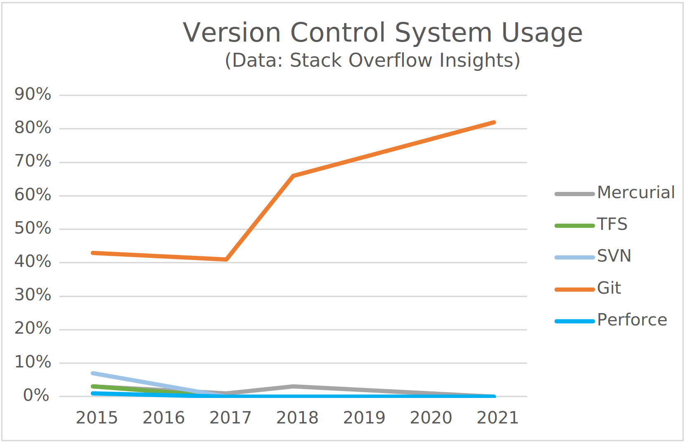

## Introduction to Git: Git is Flexible

* **Basic idea**

  > Your repository is on your computer and you can bring it into sync with other repositories (maybe somewhere else).

  ```text @plantUML
  @startuml
  [Repository 1] .down. [Repository 2]
  [Repository 1] .down. [Repository 3]
  [Repository 1] .down. [Repository 4]
  [Repository 2] .down. [Repository 3]
  [Repository 2] .down. [Repository 4]
  [Repository 3] .right. [Repository 4]
  @enduml
  ```

{{1}}
********************************************************************************

* You are able to work without internet access

  * Work on your own and sync later
  * Work in a small team and sync only locally, e.g., LAN or memory stick
  * Sync to repositories, e.g., send to you be snail mail

********************************************************************************

{{2}}
********************************************************************************

* You are able to work with internet access

  * Sync to other repositories over the internet
  * Continuously sync to one central repository over the internet

********************************************************************************

{{3}}
********************************************************************************

* You may combine all of the above
* Most common scenario:

  > Multiple local repositories are synchronised with one central repository as the truth.

********************************************************************************

## Introduction to Git: Git is Simple

**Working with a Git repository is – in principle – very simple**

  1. You make additions and changes in your workspace
  2. You add the changes you want to put in your repository to the index
  3. You commit these changes to the repository, specifying the topic of the changes
  4. You may refer to this later, push it somewhere else, or can continue with 1.

```text @plantUML
@startuml
folder evilAI
folder code
folder data
file advancedReasoning.lisp #pink
file unconscionableAI.lisp
file googleDump.csv
file facebookDump.csv
evilAI -- code
evilAI -- data
code -- advancedReasoning.lisp
code -- unconscionableAI.lisp
data -- googleDump.csv
data -- facebookDump.csv
@enduml
```

(The repository information is stored in a hidden folder in the repository directory)

{{1}}
********************************************************************************

**How Does This Work**

* When directories and files in your workspace are added to the _index_, they are transformed to _trees_ and _blobs_ and are put on the list for the next commit

********************************************************************************

{{2}}
********************************************************************************

**_Blobs_**

* Represent a file with a name specific content
* They contain the filename, the contents and have an ID

  ") <!-- width=300px -->

* Git command: [git ls-files](https://git-scm.com/docs/git-ls-files) (just FYI, you want need this very often)

********************************************************************************

{{3}}
********************************************************************************

**_Trees_**

* Represent the directory hierarchy
* They refer to _blobs_ and have an ID

  ") <!-- width=500px -->

* Git command: [git ls-tree](https://git-scm.com/docs/git-ls-tree) (again just FYI)

********************************************************************************

{{4}}
********************************************************************************

** Index**

* Represent the list of contents for the next commit to your repository
* Refers to the _tree_ and _blobs_ you added
* You may change the _index_ by adding or removing files and folders until you commit
* So, when you add your _Workspace_ directory hierarchy and some files to the _index_, this happens:

  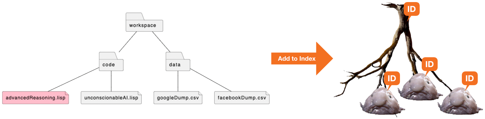 <!-- width=500px -->

* Git command: [git add](https://git-scm.com/docs/git-add)

********************************************************************************

{{5}}
********************************************************************************

**Commits**

* Have a _message_, an ID, contain a _tree_ with _blobs_ and refer to a previous commit.
* When you commit, you practically add your tree with blobs from the index to to your repository
* This is what happens:

  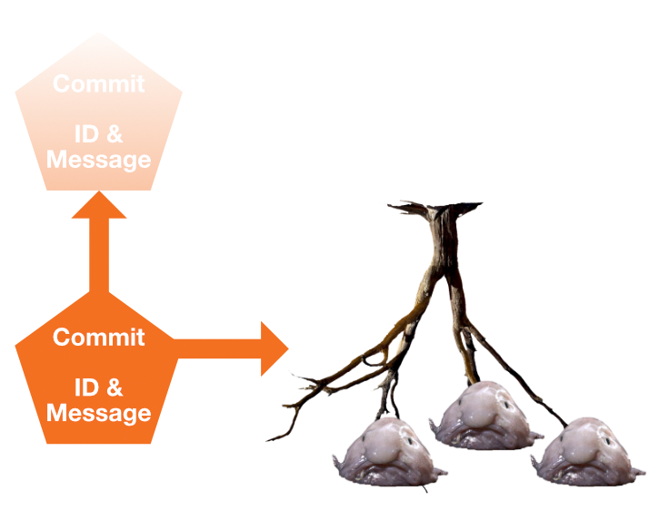

* Git command: [git commit](https://git-scm.com/docs/git-commit)

********************************************************************************

{{6}}
********************************************************************************

* Your history of commits:

   <!-- width=300px -->

* Git command: [git log](https://git-scm.com/docs/git-log)

********************************************************************************

## Introduction to Git: Tags and Branches

**Tags**

* When you want to mark a specific _commit_ for later reference, you can tag it

  * You can, e.g., mark a commit, that represents a  version of your work, such as '1.0.0' or 'preprint'

* _Tags_ have a name and always refer to the same _commit_, unless you change it yourself

  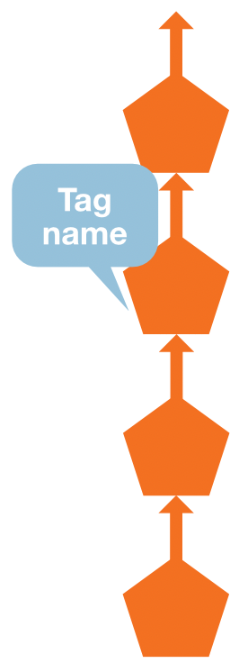 <!-- width=200px -->

* Git command: [git tag](https://git-scm.com/docs/git-tag)

{{1}}
********************************************************************************

**Branches**

* When you work with a git repository you always work in a _branch_

  * The default _branch_ is called 'main'

* When you want to bring on a development undisturbed, want to test something without making your collaborators problems, you can make a new _branch_ for this
* Common are _branches_ for

  * A _branch_ for a working version (often the 'main' _branch_)
  * A _branch_ for development (often called 'development')
  * A _branch_ for new features (normally named after the feature that is realised)

* _Branches_ are like tags and have a name and refer to a commit, but a _branch_ name always refers to the latest _commit_
* You can _merge_ _branches_ by including all commits the branch to merge in the current branch (and deal with the conflicts)

  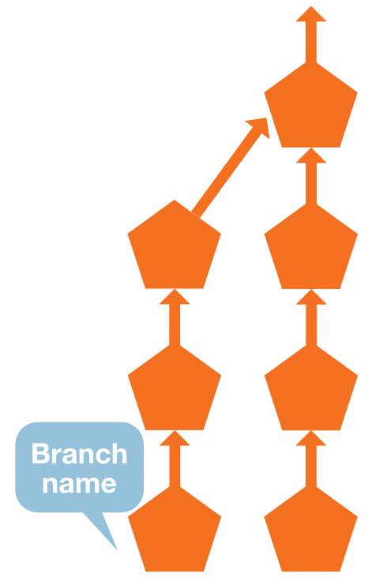  <!-- width=250px -->

* Git commands: [git branch](https://git-scm.com/docs/git-branch) and [git merge](https://git-scm.com/docs/git-merge)

********************************************************************************

## Introduction to Git: Git Usage

**Git lives on the command line**

```console
$ git --help
usage: git [--version] [--help] [-C <path>] [-c <name>=<value>]
         [--exec-path[=<path>]] [--html-path] [--man-path] [--info-path]
         [-p | --paginate | -P | --no-pager] [--no-replace-objects] [--bare]
         [--git-dir=<path>] [--work-tree=<path>] [--namespace=<name>]
         [--super-prefix=<path>] [--config-env=<name>=<envvar>]
         <command> [<args>]

These are common Git commands used in various situations:

start a working area (see also: git help tutorial)
  clone             Clone a repository into a new directory
…
'git help -a' and 'git help -g' list available subcommands and some
concept guides. See 'git help <command>' or 'git help <concept>'
to read about a specific subcommand or concept.
See 'git help git' for an overview of the system.
```

* [Download Git for your operating system](https://git-scm.com/downloads)

{{1}}
********************************************************************************

**There are 3rd-party clients for using Git**

* More integrated in your **computer's GUI**, e.g.,

  * [GitKraken](https://www.gitkraken.com) (GNU/Linux, MacOS, Windows)
  * [SourceTree](https://www.sourcetreeapp.com) (MacOS, Windows)
  * [TortoiseGit](https://tortoisegit.org) (Windows)

********************************************************************************

{{2}}
********************************************************************************

* **Web GUIs**, e.g.,

  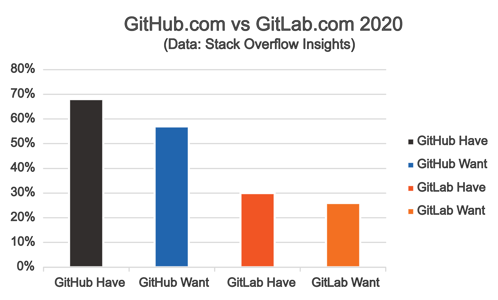 <!-- align=right width=450px -->

  * [Gitea](https://gitea.io) (on premise)
  * [GitHub](https://github.com) (SaaS, on premise)
  * [GitLab](https://gitlab.com) (SaaS, on premise)
  * [Gogs](https://gogs.io) (on premise)

********************************************************************************

## Introduction to Git: Command Overview

```text @plantUML
@startuml
Workspace -> Index: git add <file> …
Index -> Repository: git commit -m "message"
Workspace <- Repository: git checkout <branch>
Repository -> "Remote Repository": git push
Repository <- "Remote Repository": git fetch
Workspace <- Repository: git merge <commit>
Workspace <- "Remote Repository": git pull
@enduml
```

* For further information refer to the Git Documentation Reference: [git add](https://git-scm.com/docs/git-add), [git commit](https://git-scm.com/docs/git-commit), [git checkout](https://git-scm.com/docs/git-checkout), [git push](https://git-scm.com/docs/git-push), [git fetch](https://git-scm.com/docs/git-fetch), [git checkout](https://git-scm.com/docs/git-checkout), [git merge](https://git-scm.com/docs/git-merge), [git pull](https://git-scm.com/docs/git-pull)

## GitLab Hands-on

The following hands-on examples are all performed using [Gitlab RZ CAU](https://cau-git.rz.uni-kiel.de) (for more information [click here](#gitlab-rz-cau)).

- We will not go into working with the command line due to simplicity.

- All examples can be run using [Gitlab RZ CAU](https://cau-git.rz.uni-kiel.de) web interface and the Web Integrated Development Environment (IDE) editor.

- Many of the examples will be similar in other GitLab installations.

### What is GitLab

 <!-- width="250px" align="right" -->

**[GitLab](https://about.gitlab.com/) is a Git-based fully integrated platform for software development that provides complete DevOps and project management solutions.**

- GitLab is open source.
- GitLab is provided by GitLab Inc., that runs [GitLab.com](https://about.gitlab.com/) on a freemium and offers a subscription service.

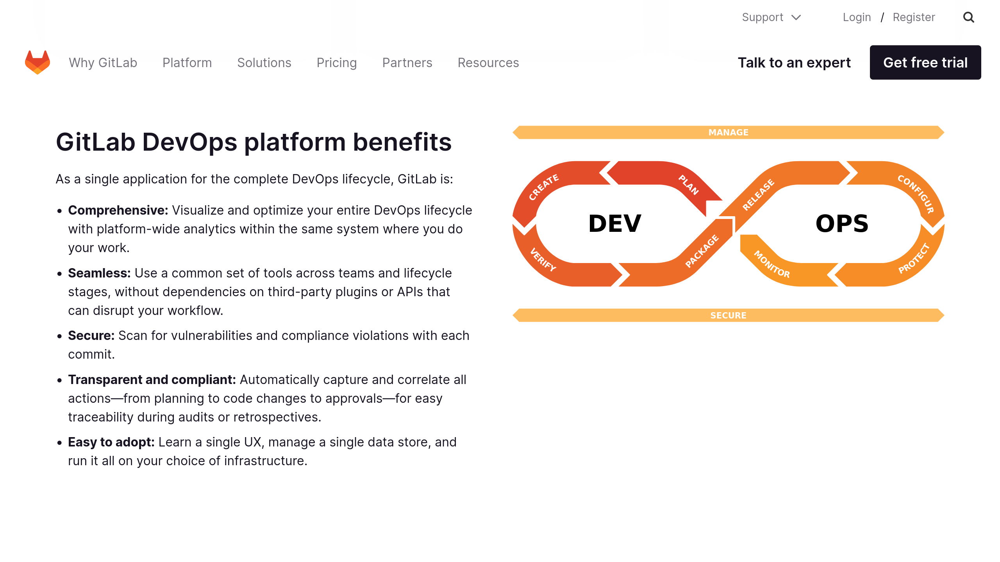<!-- style="max-width: 550px; display: block; margin: auto; padding-top:50px;" -->

{{1}}
********************************************************************************

**Projects:**

In GitLab, you can create projects that allow you to host your codebase.

In addition of the *Git repository* a project includes

- issue tracker: powerful issue tracking system.
- merge requests: you can review and discuss code before it is merged
- wiki: separate system for documentation, built right into GitLab
- and more

********************************************************************************

{{2}}
********************************************************************************

**Groups:**

A group is a collection of several projects.

- If you organize your projects under a group, it works like a directory.
- You can manage your group member’s permissions and access to each project in the group.

********************************************************************************

{{3}}
********************************************************************************

**Subgroups:**

Subgroups are nested or hierarchical groups.

- Allow you to have up to 20 levels of groups.
- You can consider subgroup as a subdirectory.

********************************************************************************

### Gitlab RZ CAU

> **The Computing Center of Kiel University centrally operates the Git service [Gitlab RZ CAU](https://cau-git.rz.uni-kiel.de/) for CAU facilities.**
>
> The service is based on a dedicated GitLab installation.
>
> You can access the service at [https://cau-git.rz.uni-kiel.de/](https://cau-git.rz.uni-kiel.de/).

{{1}}
********************************************************************************

**The functions include among others:**

- The provision of version management based on Git.
- An administration interface for the decentralized assignment of rights.
- A web interface for collaboration around projects based on GitLab, incl.

  - management of multiple development branches
  - issue management
  - integrated wiki

********************************************************************************

{{2}}
********************************************************************************

**Service registration:**

The registration takes place with the identifier for general services.

An explicit activation is not necessary for the registration.

********************************************************************************

{{3}}
********************************************************************************

**Project group assignment:**

The Computing Center of Kiel University sets up project groups on request.

- Eligible for application are the heads of the facilities known to the Computing Center.
- For each project group, one or more administrators can be defined, who are initially assigned to new project groups.
- Within project groups, group administrators can independently

  - create new projects
  - delete projects
  - assign rights to any user (with valid RZ-LDAP identification)

- Further administration of rights to subordinate groups and projects is carried out by the project administrators.

********************************************************************************

### Login

> **You can find the login page of [Gitlab RZ CAU](https://cau-git.rz.uni-kiel.de) at [https://cau-git.rz.uni-kiel.de/users/sign_in](https://cau-git.rz.uni-kiel.de/users/sign_in).**
>
> To log in you need your
>
> - RZ-LDAP username (e.g. *szrzs123*, *sughi456* etc.)
> - Password

{{1}}
********************************************************************************

**Hands-on:**

> Please try to log in to the [Gitlab RZ CAU](https://cau-git.rz.uni-kiel.de/users/sign_in) now.
>
> - If you are unable to log in, please let us know.

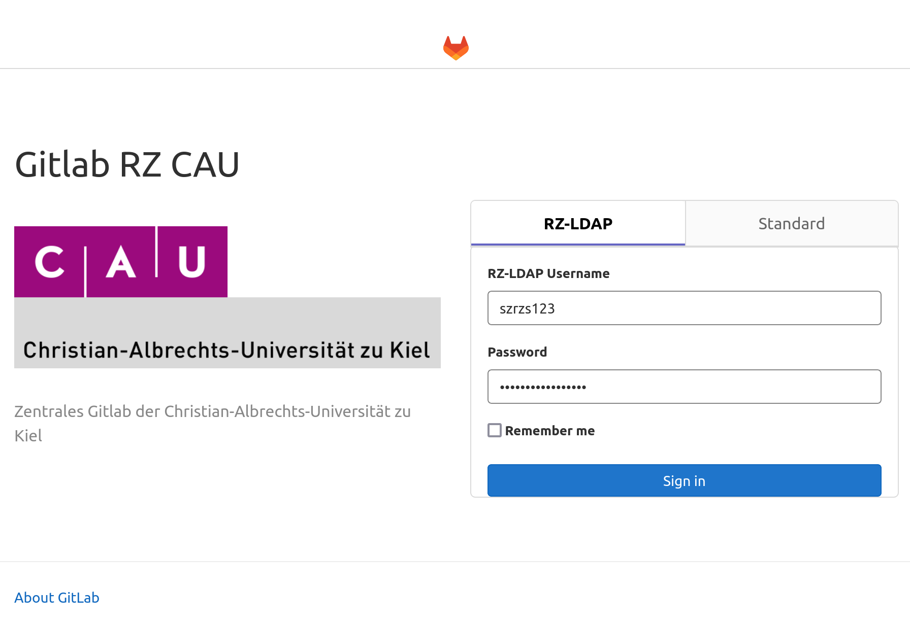<!-- style="max-width: 550px; display: block; margin: auto;" -->

********************************************************************************

{{2}}
********************************************************************************

**Terms of Service:**

If you are registering for the first time, you must agree to the *Terms of Service*.

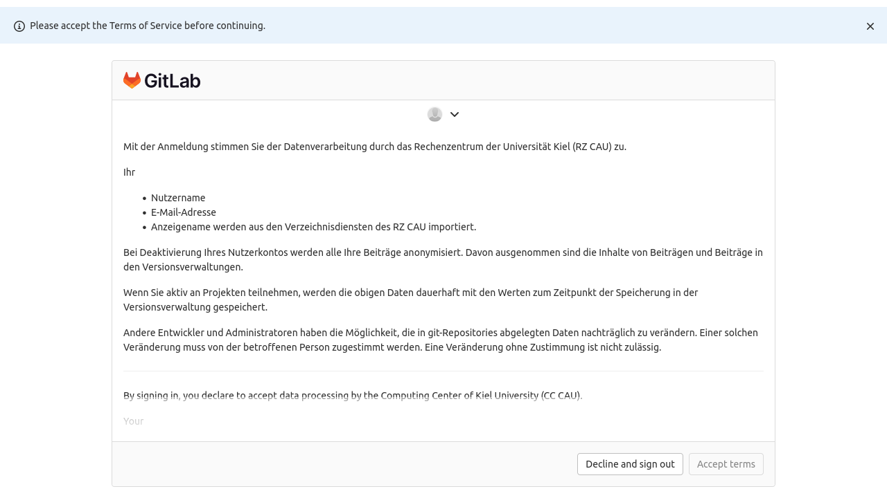<!-- style="max-width: 550px; display: block; margin: auto;" -->

********************************************************************************

{{3}}
********************************************************************************

**Did everything work out?**

If you were able to log in correctly, you will see your [dashboard](https://cau-git.rz.uni-kiel.de/).

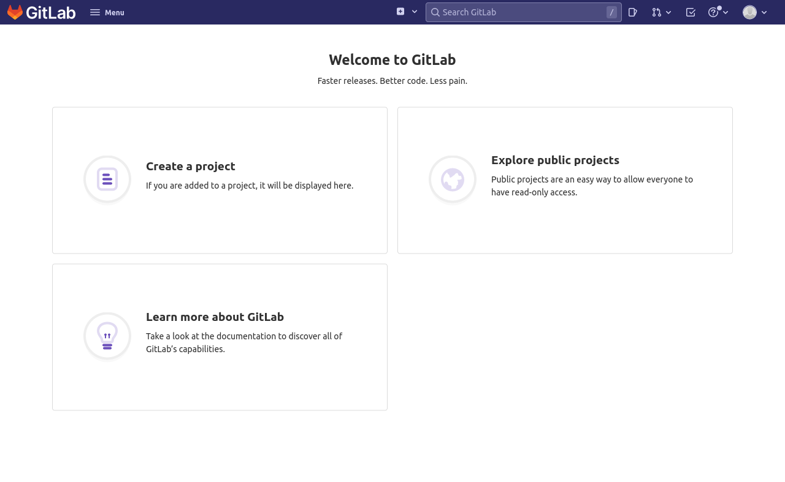<!-- style="max-width: 550px; display: block; margin: auto;" -->

*Note: If you have previously registered or have already been invited to projects or groups, you will probably see your [project overview](https://cau-git.rz.uni-kiel.de/dashboard/projects) instead.*

********************************************************************************

### Join the Småland

We have a playground subgroup called [Småland](https://cau-git.rz.uni-kiel.de/fdm/smaland) that we would like to invite you to join.

We would like to do this by creating another subgroup for you in [Småland](https://cau-git.rz.uni-kiel.de/fdm/smaland). There you can create projects and test the GitLab tools.

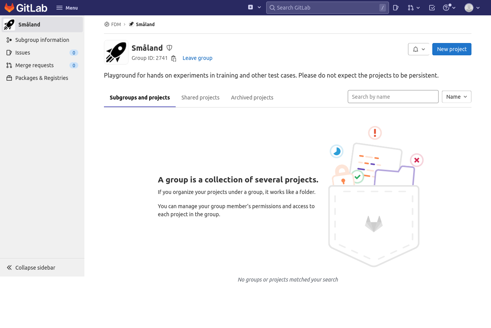<!-- style="max-width: 550px; display: block; margin: auto;" -->

{{1}}
********************************************************************************

**Invitation to the Småland:**

Please share your user ID with us now so that we can create a new subgroup for you in our [Småland](https://cau-git.rz.uni-kiel.de/fdm/smaland).

We will then invite you to your new subgroup and give you *owner* permissions.

********************************************************************************

{{2}}
********************************************************************************

**Find your groups:**

Have you already been invited? Let's find out..

To show an overview of all your [groups](https://cau-git.rz.uni-kiel.de/dashboard/groups), click on the *Groups* tab in the main menu and then on the *Your Groups* submenu item.

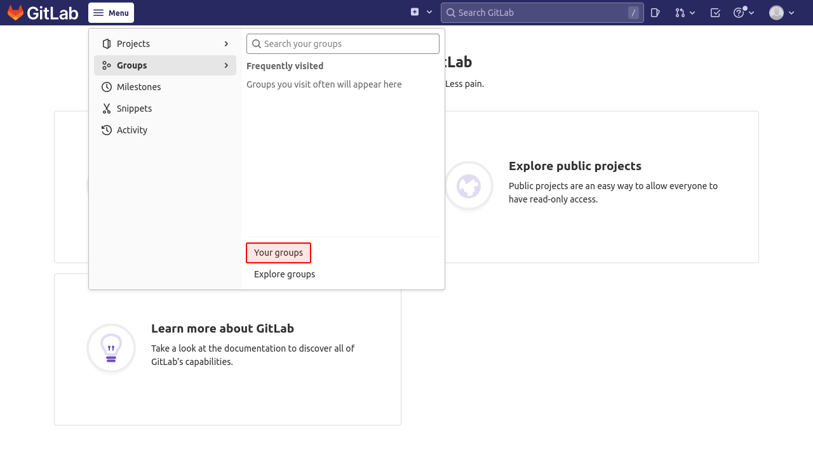<!-- style="max-width: 550px; display: block; margin: auto;" -->

********************************************************************************

{{3}}
********************************************************************************

**Your groups:**

You will now see some information about your groups.

If you expand the [FDM](https://cau-git.rz.uni-kiel.de/fdm) and the [Småland](https://cau-git.rz.uni-kiel.de/fdm/smaland) (sub)groups, you will also be able to see your new subgroup we just invited you to.

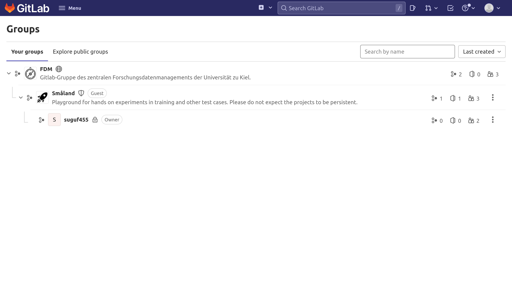<!-- style="max-width: 550px; display: block; margin: auto;" -->

*Note, you should have guest role in [Småland](https://cau-git.rz.uni-kiel.de/fdm/smaland) subgroup and owner role in your own subgroup.*

********************************************************************************

### Create a new project

> **In GitLab, you can create projects to host your codebase**
>
> If you want to create projects, your account must be assigned to a *group* and have at least *developer* permissions.

Projects can be available

- *publicly* (not available by default in Gitlab RZ CAU)
- *internally*
- *privately*

{{1}}
********************************************************************************

**Create new project:**

To [create a new project](https://cau-git.rz.uni-kiel.de/projects/new), click on the *Projects* tab in the main menu and then on the *Create new project* submenu item.

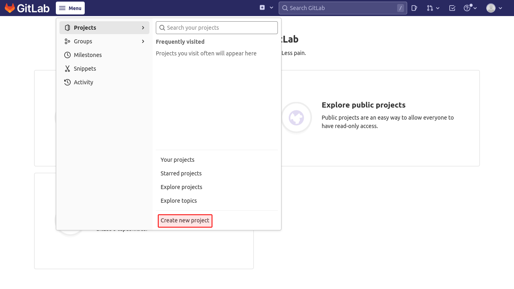<!-- style="max-width: 550px; display: block; margin: auto;" -->

********************************************************************************

{{2}}
********************************************************************************

**Create blank project:**

Create a *blank project* to house your files, plan your work, and collaborate on code, among other things.

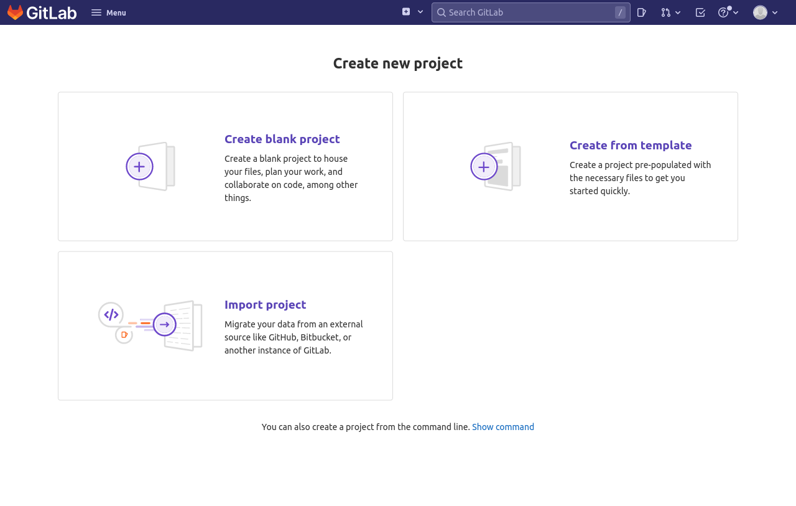<!-- style="max-width: 550px; display: block; margin: auto;" -->

********************************************************************************

{{3}}
********************************************************************************

**Fill out the details:**

You can now fill in some details about your project.

- In the *Project name* text box, you can enter your project name.
- In the *Project description* text box, you can enter your project description.

Finally click the *Create project* button at the bottom of the page.

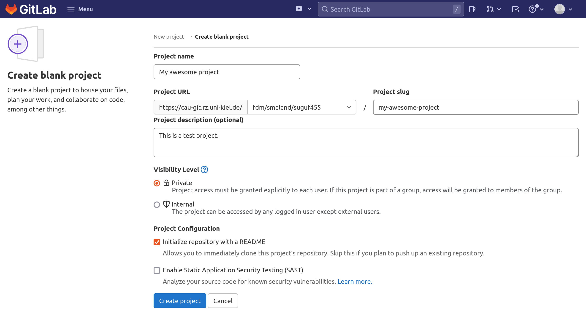<!-- style="max-width: 550px; display: block; margin: auto;" -->

*Note, in the project URL textbox you can select from a drop-down menu your groups of which you are a member and have appropriate rights to create projects.*

********************************************************************************

{{4}}
********************************************************************************

**That's it:**

You have successfully created a blank project.

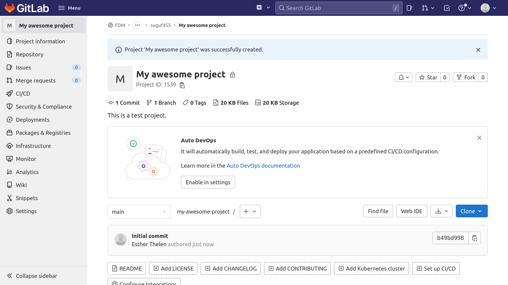<!-- style="max-width: 550px; display: block; margin: auto;" -->

********************************************************************************

### Create files and directories

> **Once you have created a project you can start to create or to add files and directories to your project.**
>
> In this example you will use the Web Integrated Development Environment (IDE) editor to contribute changes to your project.

You can add a file to your project by

- [creating a new file](#create-a-new-file)
- [uploading an existing file](#upload-an-existing-file)

#### Create a new file

Let's start by creating a new file.

{{1}}
********************************************************************************

**Open the Web IDE:**

Use the `.` keyboard shortcut to open the Web IDE or click on the *Web IDE* button in your project overview:

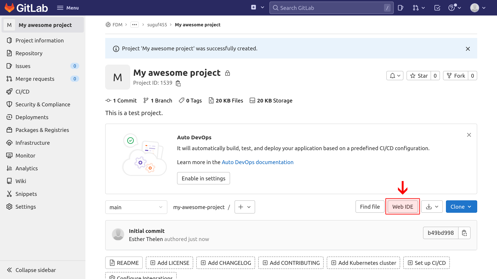<!-- style="max-width: 550px; display: block; margin: auto;" -->

*Note, you can also open the Web IDE when viewing a file, from the repository file list, and from merge requests.*

********************************************************************************

{{2}}
********************************************************************************

**The Web IDE:**

The Web IDE editor streamlines the process to contribute changes to your projects, by providing an advanced editor with commit staging.

The left sidepanel contains

- your project name and url on the top
- tabs to switch between the *edit*, the *review* and the *commit* view
- in *edit* view the menu displays

  - a select field to select the *working branch* (we only use *main* here)
  - a file and folder view of your project
  - buttons to create or upload new files and directories

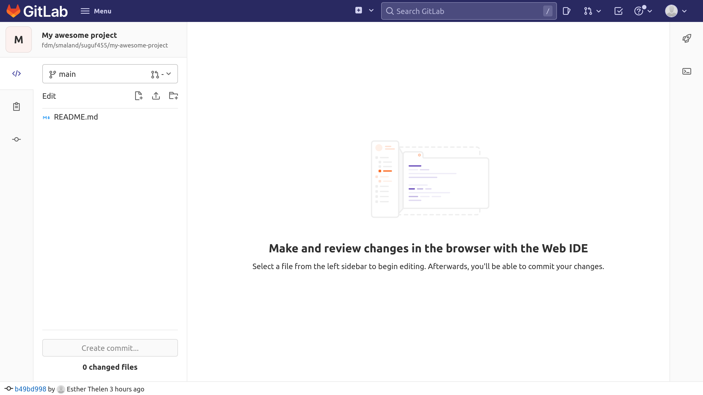<!-- style="max-width: 550px; display: block; margin: auto;" -->

*Note that another file (README.md) is already included in your project. This was automatically created for you when you created the project in the previous example. This special Markdown file will be used in your project overview to describe the project.*

********************************************************************************

{{3}}
********************************************************************************

**Create your file:**

Please click on the *new file* icon to create a new file.

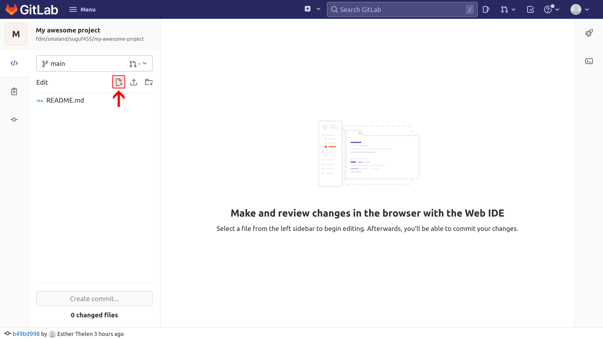<!-- style="max-width: 550px; display: block; margin: auto;" -->

********************************************************************************

{{4}}
********************************************************************************

**Name your file:**

Once you clicked on *new file* icon the system will lead you to a more or less blank page. Fill the empty field on top of the page with a file name. Don't forget the file extension. The selection of a template type is not mandatory.

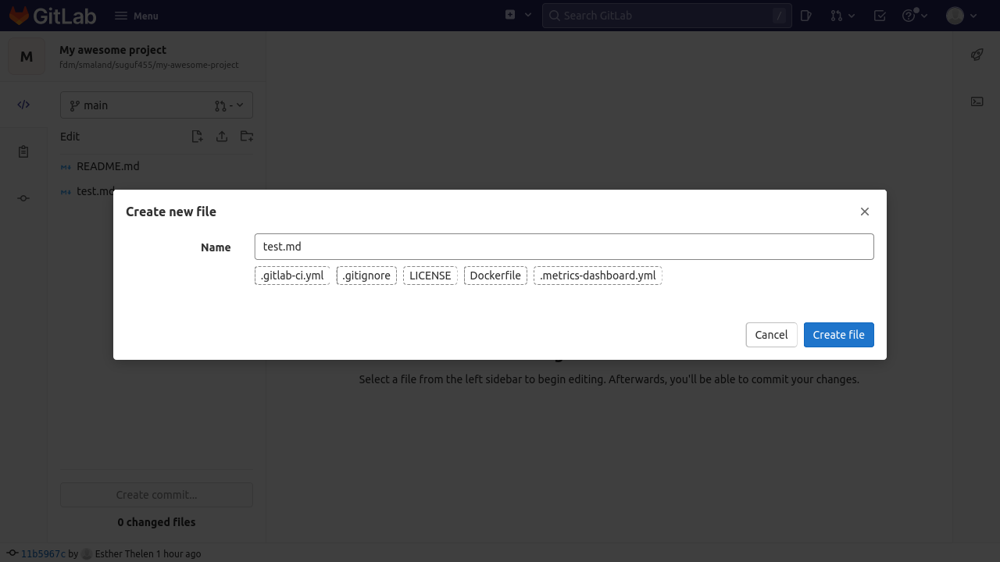<!-- style="max-width: 550px; display: block; margin: auto;" -->

********************************************************************************

{{5}}
********************************************************************************

**Make changes and commit them:**

You can now add some contents to the file, if you like. We added some simple Markdown in the file editor as an example.

Any changes you make to the files and folders of your project will not become active immediately, you must first commit the changes.

Click on the *Create commit...* button to prepare the commit.

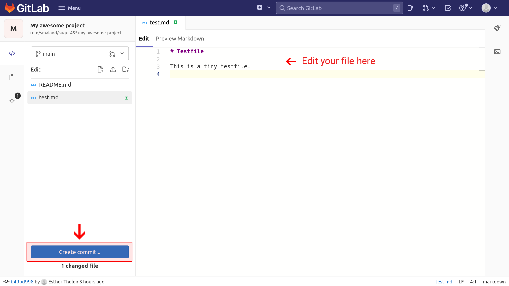<!-- style="max-width: 550px; display: block; margin: auto;" -->

********************************************************************************

{{6}}
********************************************************************************

**Fill out the details:**

Every commit needs a commit message.

1. Please provide a brief description of the changes you made in the *Commit Message* text box.
2. We are working on only one branch in this example, the *main* branch. Therefore, select the *Commit to main branch* option.
3. Finish with pressing the *Commit* button.

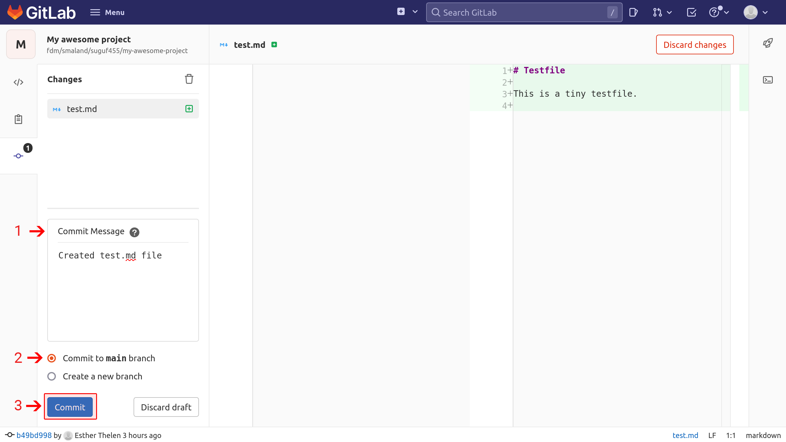<!-- style="max-width: 550px; display: block; margin: auto;" -->

********************************************************************************

{{7}}
********************************************************************************

**That's it:**

The system lets you know that the changes have been successfully committed.

You should now be able to see your newly added file in the *file overview* of your project.

To open the file overview, click on the submenu item *Files* in the side menu under *Repository*.

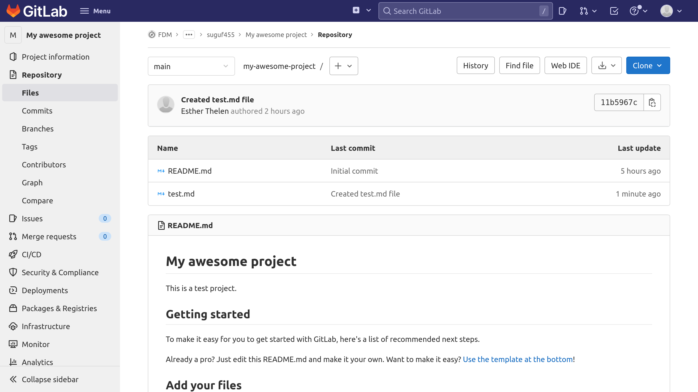<!-- style="max-width: 550px; display: block; margin: auto;" -->

********************************************************************************

{{8}}
********************************************************************************

**Commit history:**

You should also be able to see your commit history in the *commit view* of your project.

To open the commit view, click on the submenu item *Commits* in the side menu under *Repository*.

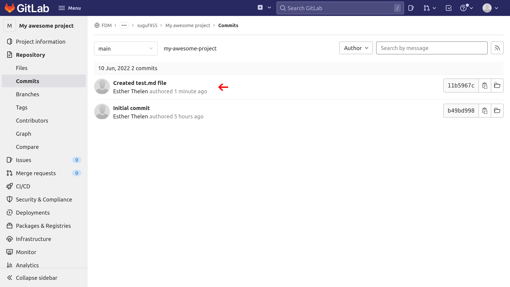<!-- style="max-width: 550px; display: block; margin: auto;" -->

********************************************************************************

#### Upload an existing file

Now let us upload an existing file. It is even easier.

{{1}}
********************************************************************************

**Open the Web IDE:**

Use the `.` keyboard shortcut to open the Web IDE or click on the *Web IDE* button in your project overview:

<!-- style="max-width: 550px; display: block; margin: auto;" -->

*Note, you can also open the Web IDE when viewing a file, from the repository file list, and from merge requests.*

********************************************************************************

{{2}}
********************************************************************************

**Select the file to upload:**

Please click on the *upload file* icon to select a file to upload.

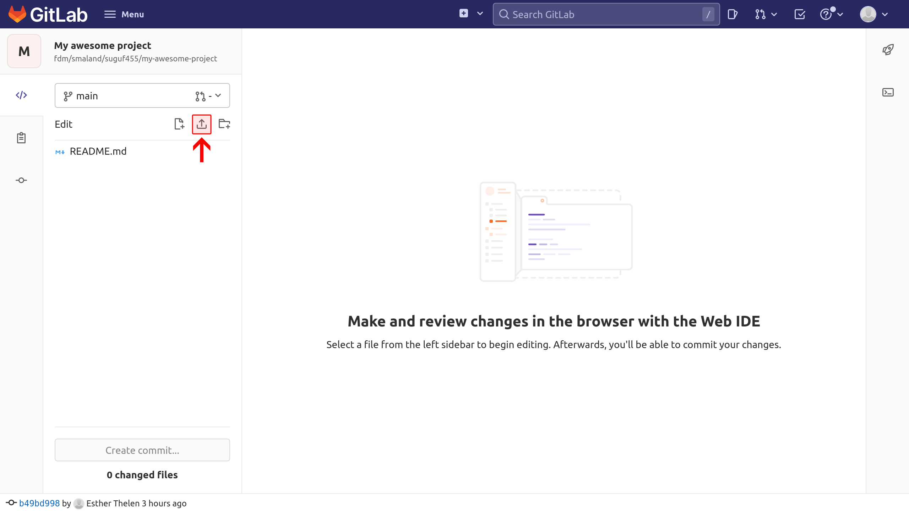<!-- style="max-width: 550px; display: block; margin: auto;" -->

********************************************************************************

{{3}}
********************************************************************************

**Your file:**

We uploaded a Markdown file called *test.md* here. It just contains some simple text.

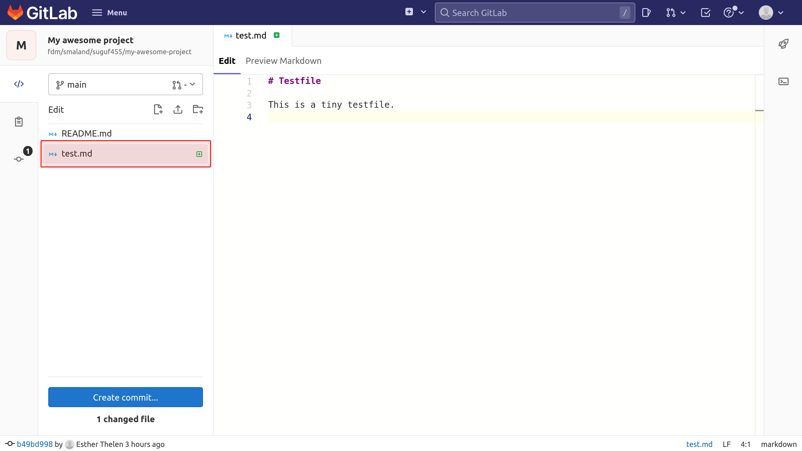<!-- style="max-width: 550px; display: block; margin: auto;" -->

********************************************************************************

{{4}}
********************************************************************************

**Commit your changes:**

Click on the *Create commit...* button to prepare the commit.

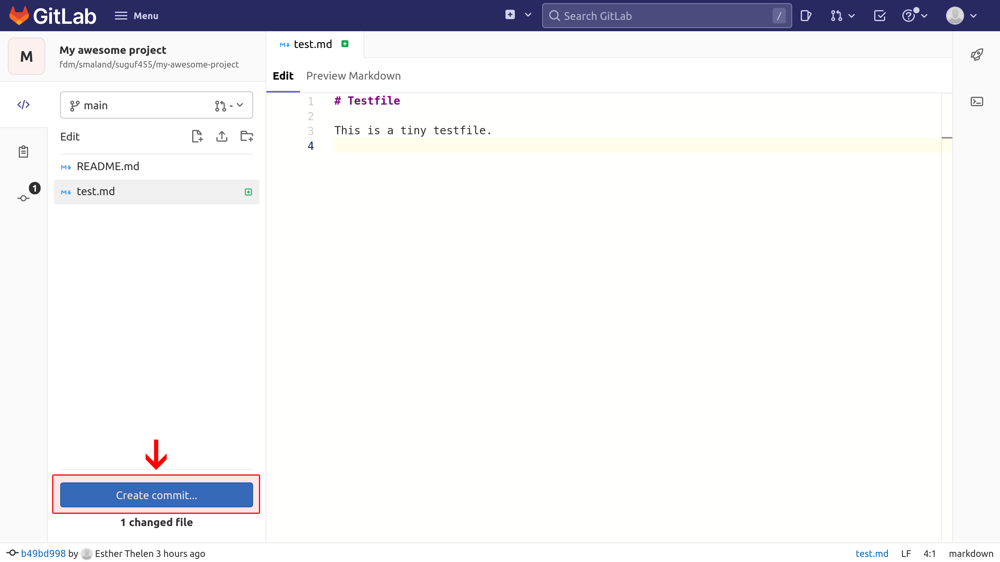<!-- style="max-width: 550px; display: block; margin: auto;" -->

********************************************************************************

{{5}}
********************************************************************************

**Fill out the details:**

Again, leave a commit message describing your action and finish with pressing the *Commit* button.

1. Please provide a brief description of the changes you made in the *Commit Message* text box.
2. We are working on only one branch in this example, the *main* branch. Therefore, select the *Commit to main branch* option.
3. Finish with pressing the *Commit* button.

<!-- style="max-width: 550px; display: block; margin: auto;" -->

********************************************************************************

{{6}}
********************************************************************************

**That's it:**

The system lets you know that the changes have been successfully committed.

You should now be able to see your newly added file in the *file overview* of your project.

To open the file overview, click on the submenu item *Files* in the side menu under *Repository*.

<!-- style="max-width: 550px; display: block; margin: auto;" -->

********************************************************************************

#### Create a directory

You want to organize your files in folders? You can also create directories via the Web IDE.

{{1}}
********************************************************************************

**Open the Web IDE:**

Use the `.` keyboard shortcut to open the Web IDE or click on the *New dicretory* button in your project overview:

<!-- style="max-width: 550px; display: block; margin: auto;" -->

*Note, you can also open the Web IDE when viewing a file, from the repository file list, and from merge requests.*

********************************************************************************

{{2}}
********************************************************************************

**Create your directory:**

Please click on the *Create directory* icon to create a new directory.

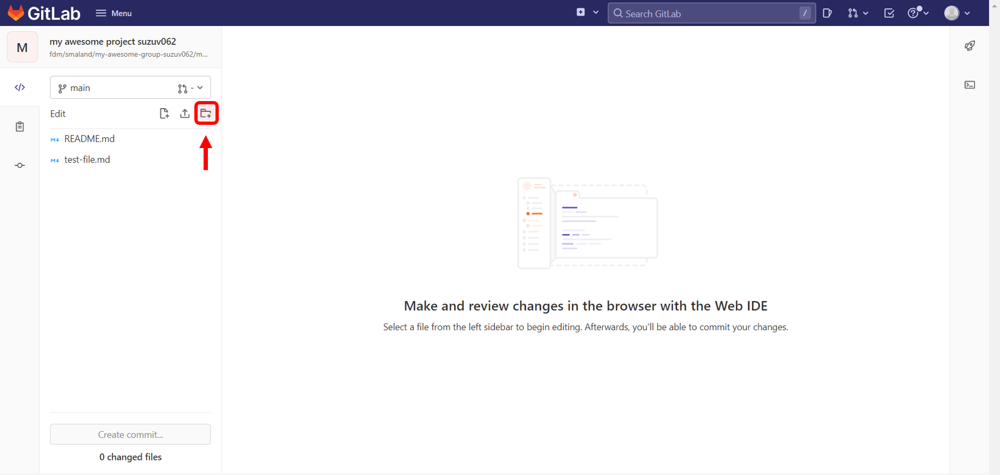<!-- style="max-width: 550px; display: block; margin: auto;" -->

********************************************************************************

{{3}}
********************************************************************************

**Name your directory:**

Enter a name for your new directory and confirm your input by clicking the blue button *Create directory*.

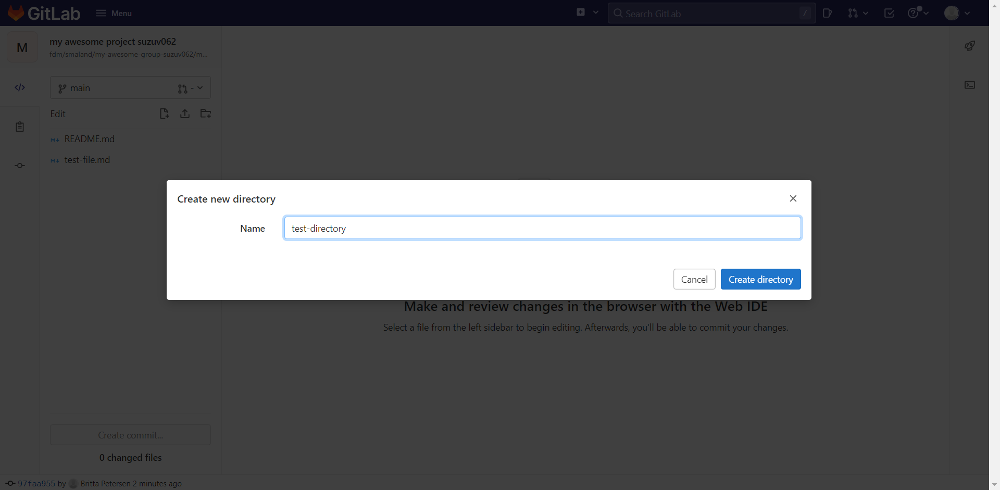<!-- style="max-width: 550px; display: block; margin: auto;" -->

********************************************************************************

{{4}}
********************************************************************************

**Add a file to your new directory:**

Your new directory appears in your file list on the left side, but the system does not allow you to create a commit unless you add a file to your new directory, either by creating a new file or by uploading an existing file.

To do so, click on the three dots next to your new directory which appear when you move your mouse to the directory and either choose *New file* or *Upload file*. Than follow the steps described under [creating a new file](#create-a-new-file) or [uploading an existing file](#upload-an-existing-file).

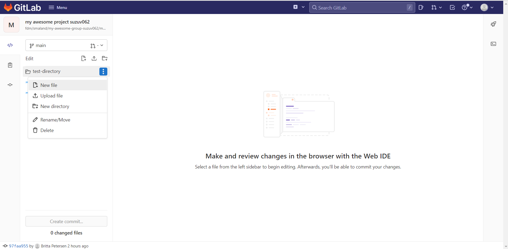<!-- style="max-width: 550px; display: block; margin: auto;" -->

********************************************************************************

{{5}}
********************************************************************************

**Create a commit and fill out the details:**

Leave a commit message describing your action and finish with pressing the *Commit* button.

1. Please provide a brief description of the changes you made in the *Commit Message* text box.
2. We are working on only one branch in this example, the *main* branch. Therefore, select the *Commit to main branch* option.
3. Finish with pressing the *Commit* button.

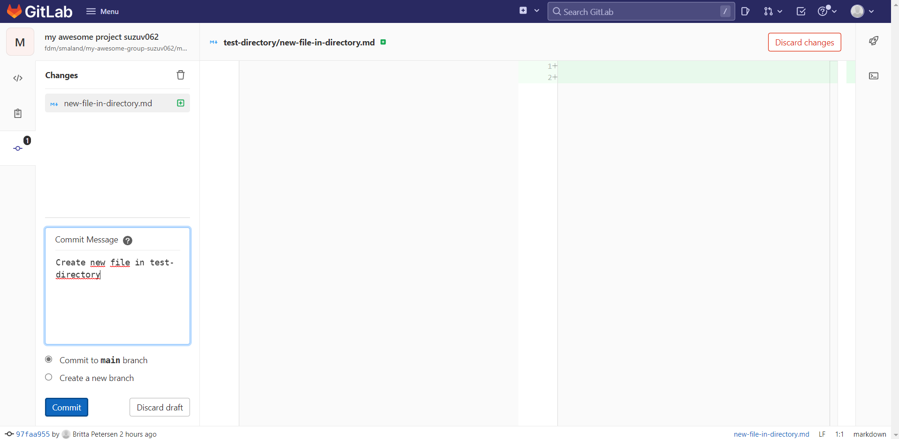<!-- style="max-width: 550px; display: block; margin: auto;" -->

********************************************************************************

{{6}}
********************************************************************************

**That's it:**

The system lets you know that the changes have been successfully committed.

You should now be able to see your newly added directory in the *file overview* of your project. To do this, click on the submenu item *Files* in the side menu under *Repository*.

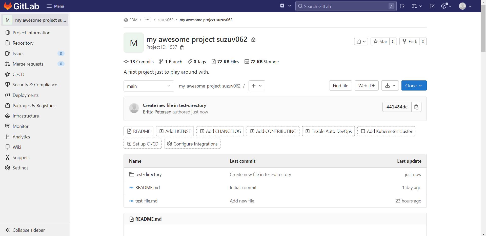<!-- style="max-width: 550px; display: block; margin: auto;" -->

********************************************************************************

### Merge conflicts

> *Merge conflicts* happen when the two branches in a merge request (the source and target) each have different changes, and you must decide which change to accept.
>
> - In a merge request, Git compares the two versions of the files line by line.
> - In most cases, GitLab can merge changes together.
> - However, if two branches both change the same lines, GitLab blocks the merge, and you must choose which change you want to keep.

{{1}}
********************************************************************************

If your merge conflict meets all of the following criteria, you can resolve the merge conflict in the GitLab user interface:

- The file is text, not binary.
- The file is in a UTF-8 compatible encoding.
- The file does not already contain conflict markers.
- The file, with conflict markers added, is less than 200 KB in size.
- The file exists under the same path in both branches.

********************************************************************************

#### Types of conflict resolution

There are several different ways we might want to resolve a conflict:

- Just pick one version, and use that.
- Keep the lines from both versions.
- Write your own resolution manually.

{{1}}
********************************************************************************

**A typical conflict:**

- Suppose person A and person B start off with version 1 of a file from the remote repo.
- Person A makes some changes resulting in version 2A
- Person B makes some changes resulting in version 2B.
- Next, person A pushes some changes, so the repository now has version 2A and a record of how to get from version 1 to version 2A.
- Now when person B tries to push his changes, the repository knows how to get from version 1 to version 2B.
- However, what the repository needs to know is how to merge versions 2A and 2B into a version 3.
- To resolve this conflict, person B performs a pull so that his repositoy contains a mix of versions 2A and 2B; any differences between person B's and person A's files will be marked. Once person B has resolved the differences, he can push version 3 to the repository.

```text @mermaid
graph LR
    A[Version 1] --> |Person B tries<br>to push changes<br>causing a merge conflict| B[Version 2B]
    A --> |Person A <br>pushes changes| C[Version 2A]
    C --> D[Version 2AB]
    B --> |Person B<br>pulls version 2A<br>creating marked files| D
    D --> |Person B resolves<br>merge conflicts| E[Version 3]
```

********************************************************************************

#### Example of a merge conflict

**Let us demonstrate this with an example:**

- We now want everyone to find a partner.
- We want to provoke a merge conflict by having two of you each make changes to the same file that cannot be automatically merged.
- You can choose who wants to do a little more work (*person A*) and who wants to do a little less (*person B*).

If everyone has found a partner and it is clear who is *person A* and who is *person B*, we can start.

{{1}}
********************************************************************************

**Overview:**

We'll go through the process step by step with you in a moment, but here's an overview:

1. person A invites person B to your repository created in the previous example
2. person A grants person B *maintainer* role
3. person A opens an existing file from your repository in the Web IDE editor.
4. person B opens the same file in a separate Web IDE editor
5. person A inserts changes in a line of your choice
6. person B makes other changes to the same line
7. person B creates a commit
8. person A creates a commit (-> merge conflict)
9. person A resolves the merge conflict

********************************************************************************

{{2}}
********************************************************************************

**Invite person B to your repository (person A):**

TODO

- invite
- grant maintainer role

********************************************************************************

{{3}}
********************************************************************************

**Open an existing file in the Web IDE (person A):**

Use the `.` keyboard shortcut to open the Web IDE or click on the *Web IDE* button in your project overview. Then select a file in the file and folder view, e.g. the *README.md* file.

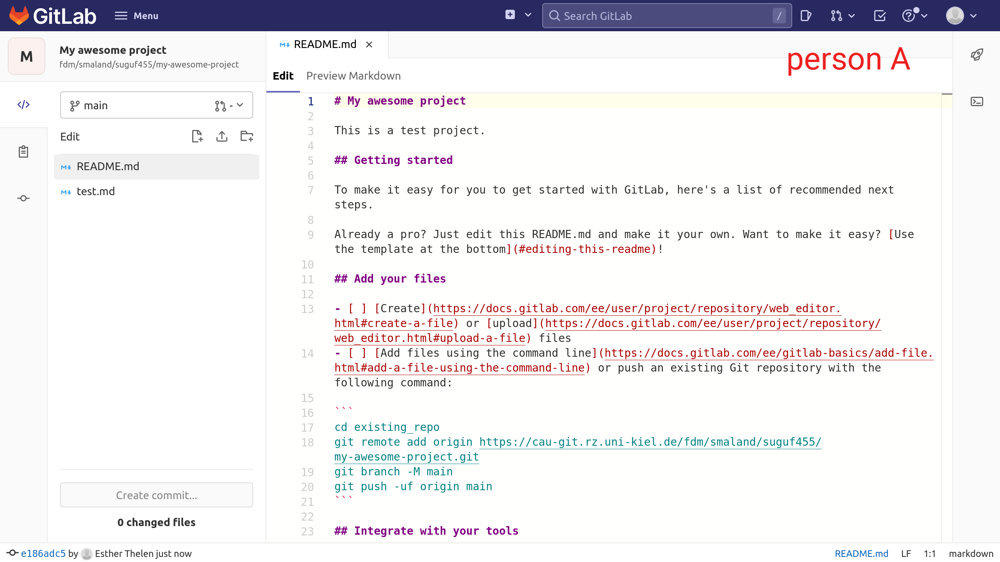<!-- style="max-width: 550px; display: block; margin: auto;" -->

********************************************************************************

{{4}}
********************************************************************************

**Open the same file in the Web IDE (person B):**

Use the `.` keyboard shortcut to open the Web IDE or click on the *Web IDE* button in the project overview. Then select the same file that person A opened in the file and folder view.

You should now both see the same view of the file.

********************************************************************************

{{5}}
********************************************************************************

**Make changes (person A):**

1. Now make changes to the file. For example, change the title `My awesome project` to `My really awesome project`.

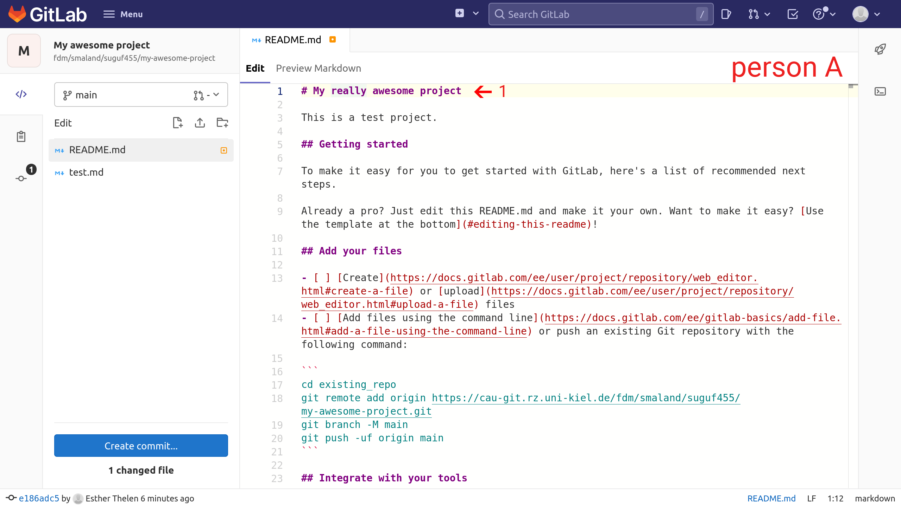<!-- style="max-width: 550px; display: block; margin: auto;" -->

********************************************************************************

{{6}}
********************************************************************************

**Make changes (person B):**

1. Now make changes to the the same file.

    - To provoke a merge conflict, make changes to the same line that person A made changes to.
    - For example, change the title `My awesome project` to `The most awesome project on GitLab`.

2. Click on the *Create commit...* button to prepare the commit.

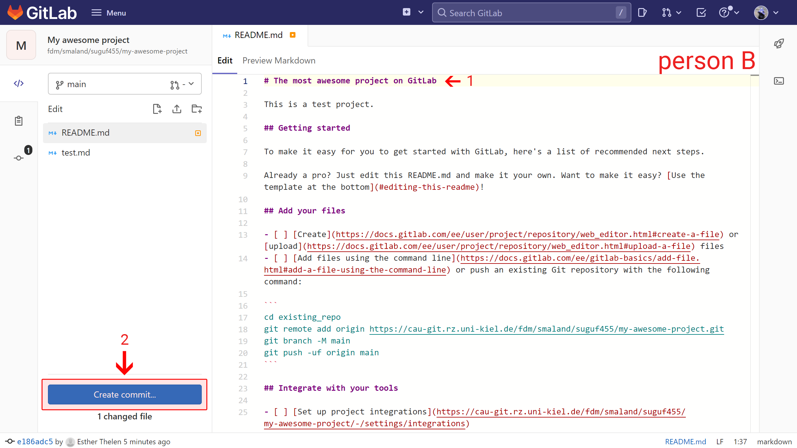<!-- style="max-width: 550px; display: block; margin: auto;" -->

********************************************************************************

{{7}}
********************************************************************************

**Create a commit and fill out the details (person B):**

Leave a commit message describing your action and finish with pressing the *Commit* button.

1. Please provide a brief description of the changes you made in the *Commit Message* text box.
2. We are working on only one branch in this example, the *main* branch. Therefore, select the *Commit to main branch* option.
3. Finish with pressing the *Commit* button.

The commit should be accepted without a conflict.

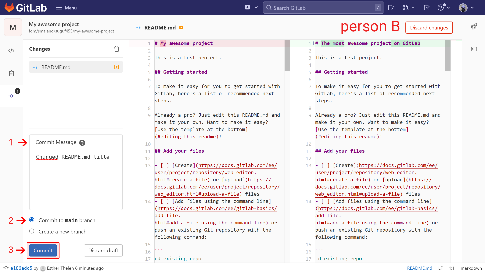<!-- style="max-width: 550px; display: block; margin: auto;" -->

********************************************************************************

{{8}}
********************************************************************************

**Create a commit and fill out the details (person A):**

Click on the *Create commit...* button to prepare the commit. Leave a commit message describing your action and finish with pressing the *Commit* button.

1. Please provide a brief description of the changes you made in the *Commit Message* text box.
2. We are working on only one branch in this example, the *main* branch. Therefore, select the *Commit to main branch* option.
3. Finish with pressing the *Commit* button.

**(!)** The commit should provoke a conflict.

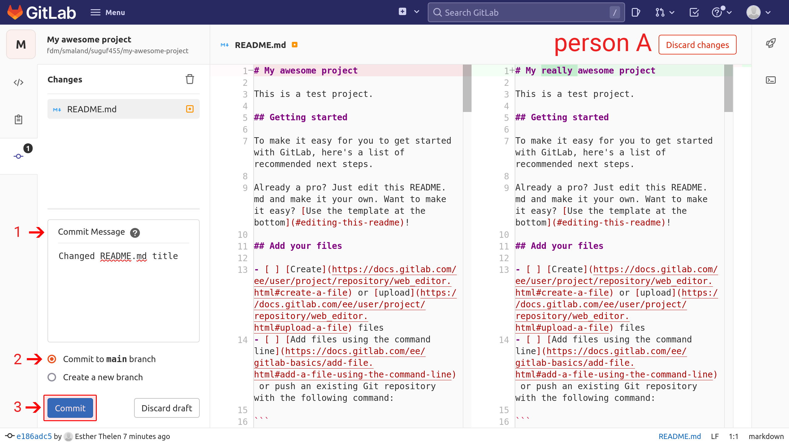<!-- style="max-width: 550px; display: block; margin: auto;" -->

********************************************************************************

{{9}}
********************************************************************************

**Choose new branch (person A):**

If you have created a change that Git does not automatically merge, GitLab will inform you that the file has changed.

You will no longer be able to store your results in the *main* branch (with which we started the work).

Instead, you can create a new branch.

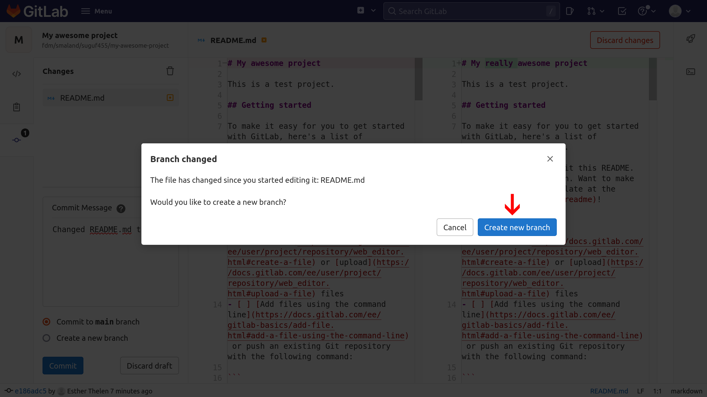<!-- style="max-width: 550px; display: block; margin: auto;" -->

********************************************************************************

{{10}}
********************************************************************************

**Create merge request (person A):**

GitLab now asks you to create a *merge request* to merge the new state written by person B on branch main with the state stored by person A on the separate branch.

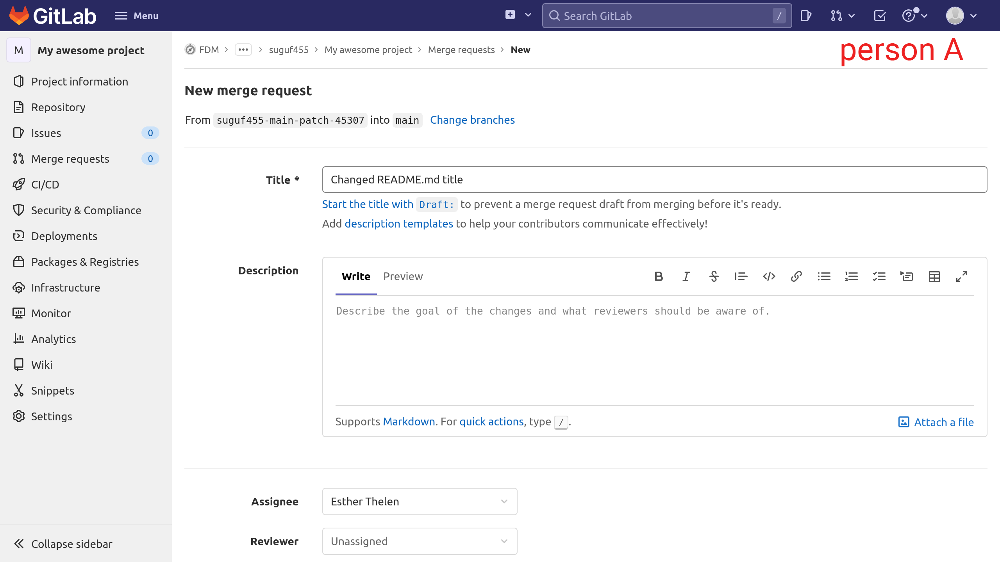<!-- style="max-width: 550px; display: block; margin: auto;" -->

We do not need to create a merge request if we want to follow up the work results of person A and B separately.

In this case, however, we want to create a merge request, so scroll to the bottom of the page and click the *Create merge request* button.

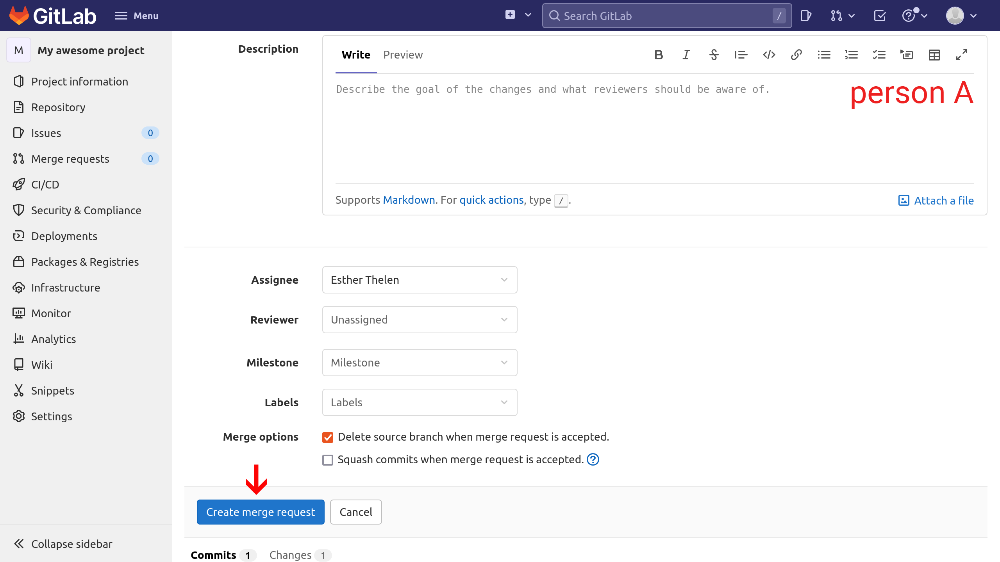<!-- style="max-width: 550px; display: block; margin: auto;" -->

********************************************************************************

{{11}}
********************************************************************************

**Resolve conflicts (person A):**

The merge request should now be created and GitLab will inform you that there are conflicts that we want to fix now.

Click the *Resolve conflicts* button.

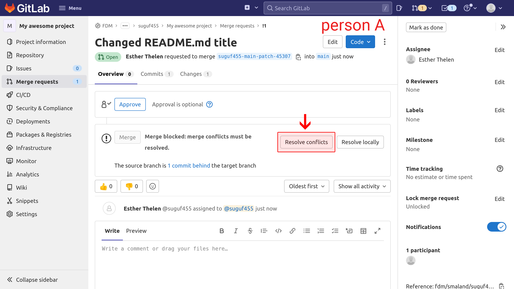<!-- style="max-width: 550px; display: block; margin: auto;" -->

********************************************************************************

{{12}}
********************************************************************************

**Choose what changes to merge (person A):**

You can now select which changes should be applied.

- If you want to compare both versions next to each other click the *Sidy-by-side* button.
- If you want to merge content from both versions, you have to do it manually. To do this, click *Edit inline*.

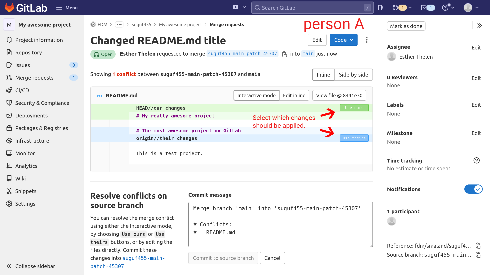<!-- style="max-width: 550px; display: block; margin: auto;" -->

********************************************************************************

{{13}}
********************************************************************************

**Commit to source branch (person A):**

In this example we decided to choose the version of person B and clicked "Use theirs".

The corresponding change is highlighted and since it is the only one, we can now resolve the merge conflict by clicking on the *Commit to source branch* button.

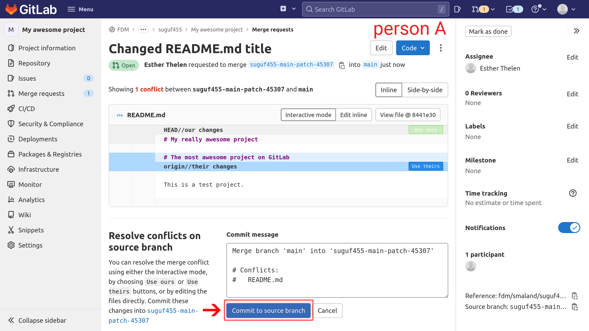<!-- style="max-width: 550px; display: block; margin: auto;" -->

********************************************************************************

{{14}}
********************************************************************************

**Merge (person A):**

Now that all merge conflicts have been resolved, the merge request can be completed.

To perform the merge request click on the *Merge* button.

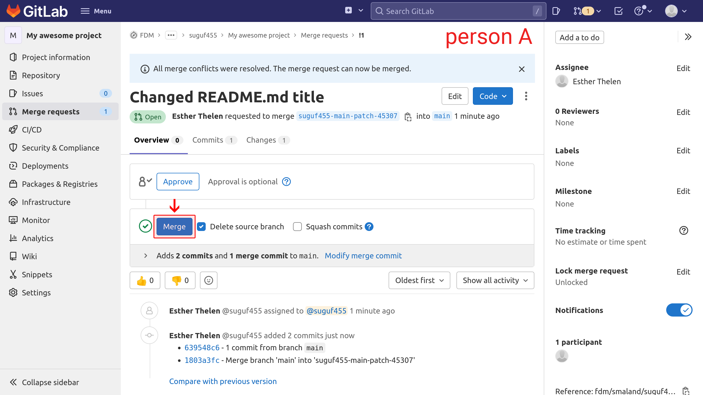<!-- style="max-width: 550px; display: block; margin: auto;" -->

********************************************************************************

{{15}}
********************************************************************************

**That's it:**

If everything worked, you will be informed that the merge was successful.

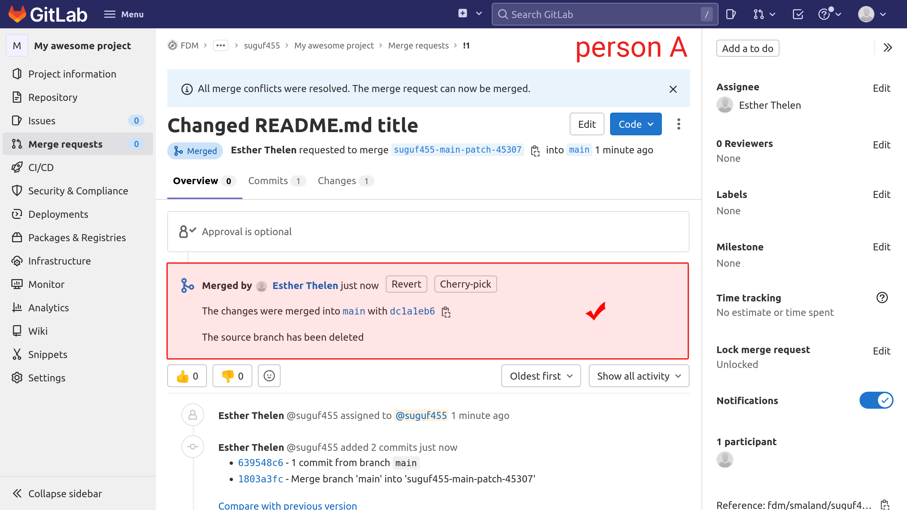<!-- style="max-width: 550px; display: block; margin: auto;" -->

********************************************************************************

## Wrap-up

## Questions or comments?

Time for open questions and discussion!

During the workshop you may also leave your questions here:

[https://zumpad.zum.de/p/sfb1261](https://zumpad.zum.de/p/sfb1261)

## Feedback

We are happy about feedback.

Please let us know if the workshop was helpful for you and how you liked it.

---


## Further reading

If you want to go on learning about Git, try to have a look here:

**References**

* [Git Documentation - Reference](https://git-scm.com/docs)
* [Git from Bottom Up](https://jwiegley.github.io/git-from-the-bottom-up/)
* [Oh my Git!](https://ohmygit.org/)
